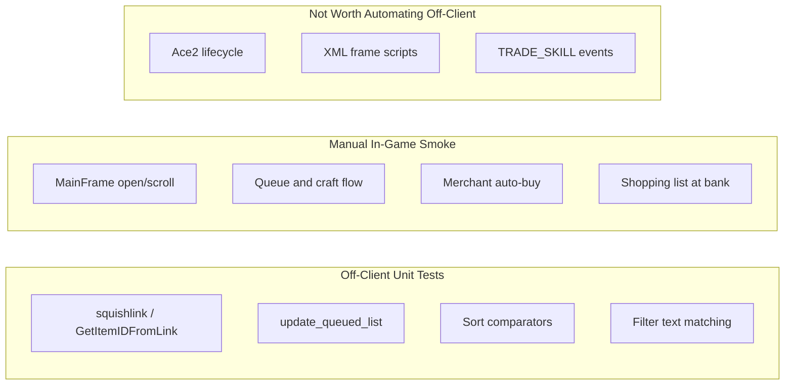

# Skillet Local Testing Strategy

## Honest Assessment

**There is no easy way to fully regression-test this addon without the game.** Skillet is tightly coupled to:

- WoW globals (`GetTradeSkillInfo`, `DoTradeSkill`, `CreateFrame`, `GameTooltip`, …)
- Ace2 lifecycle (`AceLibrary`, `AceEvent`, `AceDB`)
- XML-defined frames and scroll handlers

Roughly **80% of the codebase** (UI, event wiring, queue processing, merchant/bank integration) cannot be exercised meaningfully outside the client without a large mock harness and significant refactoring.

**What *is* feasible locally:** unit tests for **pure or mostly-pure logic** — link parsing, SavedVariables string compression, shopping-list aggregation, recipe sort comparators, and filter matching. These are the areas most likely to regress silently when fixing bugs like the tooltip error in [`exampleError.txt`](exampleError.txt).



---

## Completed Setup (manual steps done)

| Item | Status | Location / notes |
|------|--------|------------------|
| Lua 5.1 runtime | Done | **Lua for Windows** installed on dev machine |
| Test framework | Done | [`luaunit.lua`](luaunit.lua) v3.5 vendored at **project root** (bluebird75/luaunit; not loaded by [`Skillet.toc`](Skillet.toc)) |
| luarocks / busted | Not needed | luaunit replaces busted as the runner |

**Run tests from the addon root** (where `luaunit.lua` lives):

```powershell
cd c:\Users\Mark\AppData\Local\ebonhold\Interface\AddOns\Skillet
lua tests/run.lua
```

If `lua` is not on PATH in a given shell, use the Lua for Windows executable directly (typical install: `C:\Program Files (x86)\Lua\5.1\lua.exe tests/run.lua`).

---

## Recommended Approach (local-only, pragmatic)

### 1. Add a minimal test harness (next step)

Create a `tests/` directory with:

| File | Purpose |
|------|---------|
| [`tests/wow_mock.lua`](tests/wow_mock.lua) | Stub `_G` WoW APIs used by code under test (`GetItemInfo`, `GetTradeSkillInfo`, `GetItemCount`, `UnitName`, color constants) |
| [`tests/fixtures/recipes.lua`](tests/fixtures/recipes.lua) | Sample squished recipe strings, item/enchant links, mock queue DB tables |
| [`tests/test_*.lua`](tests/) | One file per domain (`test_links.lua`, `test_queue.lua`, …) |
| [`tests/run.lua`](tests/run.lua) | Bootstrap: set `package.path`, load mocks, load specs, invoke luaunit |

**Test runner:** vendored **luaunit 3.5** at [`luaunit.lua`](luaunit.lua). No luarocks dependency.

**`tests/run.lua` bootstrap pattern:**

```lua
-- Run from addon root: lua tests/run.lua
local root = arg[0]:match("^(.*[/\\])") or "./"
root = root:gsub("tests[/\\]$", "")
package.path = root .. "?.lua;" .. root .. "tests/?.lua;" .. package.path

dofile(root .. "tests/wow_mock.lua")

local lu = require("luaunit")   -- resolves to root luaunit.lua
require("test_links")           -- each test file registers TestCase classes

os.exit(lu.LuaUnit.run())
```

Individual test files use luaunit 3.x `TestCase` methods (`assertEquals`, `assertTrue`, …) or standalone `lu.assertEquals(...)` calls.

**Do not** add `luaunit.lua` or `tests/` to [`Skillet.toc`](Skillet.toc) — dev-only, never shipped to the client.

---

### 2. Extract testable logic into one small module (minimal prod change)

Most valuable pure functions are **`local`** today and unreachable from tests:

- [`SkilletStitch-1.1.lua`](SkilletStitch-1.1.lua) lines 59–88: `squishlink` / `unsquishlink`
- [`SkilletQueue.lua`](SkilletQueue.lua) lines 240–257: `update_queued_list`
- [`UI/MainFrame.lua`](UI/MainFrame.lua) lines 313–340: filter text matching inside `is_hidden_skill`

**Recommended minimal refactor:** add [`SkilletUtil.lua`](SkilletUtil.lua) loaded early in `Skillet.toc` (after locales, before Stitch):

```lua
SkilletUtil = {}
function SkilletUtil.SquishLink(link) ... end
function SkilletUtil.UnsquishLink(link) ... end
function SkilletUtil.GetItemIDFromLink(link) ... end  -- move from TradeskillInfo
function SkilletUtil.UpdateQueuedList(list, player, name, link, needed) ... end
function SkilletUtil.RecipeMatchesFilter(recipe, filtertext) ... end
```

Existing files call `SkilletUtil.*` instead of duplicating logic. Tests `dofile(root .. "SkilletUtil.lua")` directly — no Ace2, no WoW frames.

**Bootstrap option before extraction:** first `test_links.lua` can inline the squishlink bodies to prove the harness; migrate to `SkilletUtil` in step 3.

---

### 3. First test suite scope (high value, low effort)

Prioritize tests that guard real bug classes:

| Test file | Tests | Source |
|-----------|-------|--------|
| `tests/test_links.lua` | Item + enchant round-trip; malformed/nil links; item ID extraction | `SkilletUtil` squish/unsquish; `GetItemIDFromLink` |
| `tests/test_queue.lua` | Merge by name; increment count; append player names | `update_queued_list` |
| `tests/test_sort.lua` | Name order; difficulty tie-break; ascending/descending index remap | [`UI/Sorting.lua`](UI/Sorting.lua) comparators with mock stitch tables |
| `tests/test_filter.lua` | Match recipe name; match reagent name; plain-text (no regex) | Extracted filter helper from `is_hidden_skill` |

**Example high-value test** (tooltip regression class):

```lua
function TestSort:test_sortedIndexRemap()
    -- fixture: sorted_recipes = {3, 1, 2}; GetSortedRecipeIndex(2) => 1 when ascending
end
```

This directly relates to [`SetTradeSkillToolTip`](UI/MainFrame.lua) failures when UI index ≠ Blizzard skill index.

---

### 4. Static analysis (optional extra safety net)

Add [Luacheck](https://github.com/lunarmodules/luacheck) with a [`.luacheckrc`](.luacheckrc) that whitelists WoW globals. Requires luarocks (`luarocks install luacheck`) — separate from the luaunit setup.

Scope to **addon-authored files only** — exclude [`Libs/`](Libs/) and [`luaunit.lua`](luaunit.lua).

---

### 5. Manual smoke checklist (required for real regression confidence)

Document in [`.docs/MANUAL_TEST_CHECKLIST.md`](.docs/MANUAL_TEST_CHECKLIST.md) — run after any UI/event/queue change (~10 minutes):

1. Open each profession window; confirm Skillet replaces default UI
2. Filter by recipe name and reagent name
3. Sort by name, difficulty, level, quality (toggle reverse)
4. Hover recipe and each reagent tooltip (no Lua errors — covers [`exampleError.txt`](exampleError.txt))
5. Queue 2+ different recipes; Start queue; Clear queue
6. Log out/in — queue persists
7. `/skillet shoppinglist` — materials listed
8. At vendor with queued buyable reagents — buy button works
9. Linked tradeskill (from chat) — Skillet stays hidden
10. `/skillet config` — options open (out of combat)

This is the only reliable coverage for Ace2 events, frame layout, and `DoTradeSkill` queue execution.

---

## What Not to Pursue

| Approach | Why skip |
|----------|----------|
| Full in-client automation without manual steps | No headless WotLK 3.3.5a client; `/run` test scripts still require launching WoW |
| Mock entire Ace2 + all frames | High effort, fragile, poor ROI for this legacy codebase |
| Retail-style `C_TradeSkillUI` test doubles | Wrong API era for this project |
| Testing vendored [`Libs/`](Libs/) | Third-party code; out of scope |
| CI (GitHub Actions) | Local-only workflow chosen |
| busted / luarocks for test runner | Superseded by vendored [`luaunit.lua`](luaunit.lua) |

---

## Implementation Order (updated)

1. ~~Install Lua 5.1 + luaunit~~ **Done** (Lua for Windows + [`luaunit.lua`](luaunit.lua) at project root)
2. **Next:** Add `tests/wow_mock.lua`, `tests/run.lua`, and first `tests/test_links.lua` (inline squishlink logic OK initially)
3. Add [`SkilletUtil.lua`](SkilletUtil.lua) and wire callers; migrate link/queue tests to real module
4. Add sort and filter tests + `tests/fixtures/recipes.lua`
5. *(Optional)* Add `.luacheckrc` scoped to addon-authored files
6. Add [`.docs/MANUAL_TEST_CHECKLIST.md`](.docs/MANUAL_TEST_CHECKLIST.md)

**Remaining effort:** ~3–5 hours for harness + util extraction + initial tests; manual checklist ~30 minutes.

**Regression coverage after setup:** ~30–40% of logic by line count, ~70% of data-parsing/aggregation bugs — but **not** UI layout, event timing, or live crafting without the checklist.

---

## Alternative: No Unit Tests

If even minimal extraction feels like too much churn, the honest fallback is:

- **Manual checklist** after every change
- **Targeted in-game repro scripts** in [`.docs/`](.docs/) for known bugs (e.g. tooltip hover on sorted/filtered lists)

This is acceptable for a maintenance-mode WotLK addon with infrequent changes, but it will not catch link/queue/sort regressions automatically.
