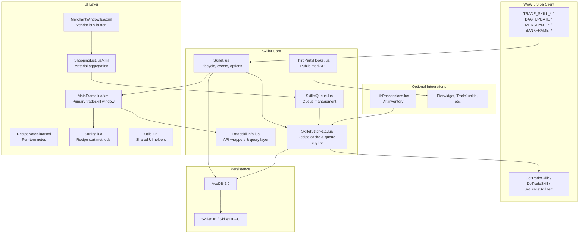

# Skillet — Repository Overview

A comprehensive reference for the **Skillet** World of Warcraft addon as present in this repository. Skillet replaces Blizzard's default tradeskill/craft window with a larger, feature-rich alternative. This copy targets **Wrath of the Lich King 3.3.5a** (`Interface: 30300`).

---

## Executive Summary

| Property | Value |
|---|---|
| **Name** | Skillet |
| **Version** | 1.13 (Curse packaged revision r167, July 2010) |
| **Author** | Robert Clark (nogudnik@gmail.com) |
| **License** | GPL v3 or later |
| **Framework** | Ace2 (AceAddon, AceEvent, AceDB, AceConsole, AceHook, AceLocale) |
| **Saved Variables** | `SkilletDB` (global), `SkilletDBPC` (per-character) |
| **Primary Purpose** | Enhanced tradeskill UI with queuing, shopping lists, alt inventory, and recipe notes |

Skillet is **not** a continuation of ATSW (Advanced Trade Skill Window) by Slarti, but a separate addon inspired by ATSW's ideas. It embeds a fork of **Stitch-1.1** (by Nymbia), renamed **SkilletStitch-1.1**, for recipe caching and craft queuing.

---

## What Skillet Does

When a player opens a profession window (Blacksmithing, Alchemy, Enchanting, etc.), Skillet intercepts the Blizzard `TRADE_SKILL_*` events, hides the default UI, and shows its own resizable frame instead. It:

1. **Scans and caches** all recipes for each profession the character knows;
2. **Displays** recipes with filtering, sorting, and craftable counts;
3. **Queues** multiple crafts (including auto-queuing craftable reagents);
4. **Persists** queues and notes across sessions;
5. **Aggregates** material requirements into a cross-alt shopping list;
6. **Integrates** with vendors (auto-buy reagents) and banks (pull materials).

---

## Architecture



### Load Order

Defined in `Skillet.toc`:

1. **Embedded libraries** via `embeds.xml` (LibStub, Ace2 stack, Waterfall, Abacus, LibPeriodicTable)
2. **Locale files** (8 languages)
3. **Core modules**: `LibPossessions.lua` → `SkilletStitch-1.1.lua` → `Skillet.lua` → `TradeskillInfo.lua` → `SkilletQueue.lua` → `ThirdPartyHooks.lua` → `Upgrades.lua`
4. **UI modules**: `Utils.lua` → `Sorting.lua` → `MainFrame` → `RecipeNotes` → `MerchantWindow` → `ShoppingList`

---

## Directory Structure

```
Skillet/
├── Skillet.toc              # Addon manifest (Interface 30300)
├── Skillet.lua              # Main addon: lifecycle, events, options, DB defaults
├── SkilletStitch-1.1.lua    # Forked Stitch library: scan, cache, queue, craft
├── SkilletQueue.lua         # Queue add/save/load/process logic
├── TradeskillInfo.lua       # Tradeskill data accessors & developer query API
├── ThirdPartyHooks.lua      # Stable public API for other addons
├── Upgrades.lua             # SavedVariables migration between versions
├── LibPossessions.lua       # Abstraction over alt-inventory addons
├── embeds.xml               # Embedded Ace2 / support libraries
├── description.txt          # Original Curse/WoWAce feature description
├── Changelog-Skillet-r167.txt
├── exampleError.txt           # Sample runtime error (tooltip bug)
├── LICENSE.txt
│
├── Locale/                    # AceLocale-2.2 translations
│   ├── Locale-enUS.lua
│   ├── Locale-deDE.lua
│   ├── Locale-esES.lua
│   ├── Locale-frFR.lua
│   ├── Locale-koKR.lua
│   ├── Locale-ruRU.lua
│   ├── Locale-zhCN.lua
│   └── Locale-zhTW.lua
│
├── UI/
│   ├── MainFrame.lua / .xml   # Primary tradeskill window (~1,400 lines XML + ~1,070 Lua)
│   ├── ShoppingList.lua / .xml
│   ├── MerchantWindow.lua / .xml
│   ├── RecipeNotes.lua / .xml
│   ├── Sorting.lua            # Built-in and extensible recipe sorters
│   └── Utils.lua              # Resize handles, info popups
│
└── Libs/                      # Vendored third-party libraries (Ace2 era)
    ├── LibStub/
    ├── AceLibrary, AceAddon-2.0, AceEvent-2.0, AceDB-2.0, ...
    ├── Waterfall-1.0/         # Options UI
    ├── Abacus-2.0/            # Number formatting
    ├── Window-1.0/
    └── LibPeriodicTable-3.1/  # Item categorization (tradeskill data sets)
```

### Code Size (addon-authored files, approximate)

| File | Lines |
|---|---|
| `UI/MainFrame.lua` | ~1,070 |
| `Skillet.lua` | ~850 |
| `SkilletStitch-1.1.lua` | ~680 |
| `ThirdPartyHooks.lua` | ~515 |
| `LibPossessions.lua` | ~465 |
| `UI/ShoppingList.lua` | ~385 |
| `UI/Sorting.lua` | ~325 |
| `SkilletQueue.lua` | ~300 |
| `TradeskillInfo.lua` | ~265 |

Embedded libraries add ~15,000+ lines but are not maintained as part of Skillet's core logic.

---

## Core Modules

### `Skillet.lua` — Orchestrator

The global `Skillet` object is an AceAddon mixing in AceConsole, AceEvent, AceDB, and AceHook.

**Responsibilities:**

- Register AceDB namespaces and default options (`profile`, `server`, `char`)
- Define the Waterfall options tree (`/skillet config`)
- Hook default tooltips to append user recipe notes
- Register WoW events and delegate to UI/Stitch
- Manage trade-skill window visibility lifecycle
- Coordinate recipe scanning on open and bag changes

**Key state:**

| Variable | Purpose |
|---|---|
| `currentTrade` | Active profession name |
| `selectedSkill` | Selected recipe index |
| `hideUncraftableRecipes` | Filter: recipes without materials |
| `hideTrivialRecipes` | Filter: grey recipes |
| `stitch` | Reference to SkilletStitch-1.1 library instance |

**Lifecycle hooks:**

- `OnInitialize` — tooltip hooks, chat commands, Stitch init
- `OnEnable` — event registration, Waterfall options panel, Stitch data gathering/queue
- `OnDisable` — tear down Stitch and events

### `SkilletStitch-1.1.lua` — Recipe Engine

A modified fork of Nymbia's Stitch library. Central to all recipe data.

**Capabilities:**

- **Scan** open tradeskill window and cache recipe metadata (reagents, links, difficulty, vendor flags)
- **Compute** `numcraftable`, `numcraftablewbank`, `numcraftablewalts` via metatable `__index`
- **Queue** crafts and process them sequentially via `DoTradeSkill`
- **Squish/unsquish** item links for compact SavedVariables storage
- **Integrate** LibPeriodicTable for vendor-purchasable reagent detection
- **Fire events**: `SkilletStitch_Scan_Complete`, `SkilletStitch_Queue_*`

Recipe data is stored per character under `SkilletDB.server.recipes[playerName][professionName]`.

### `SkilletQueue.lua` — Queue Management

Wraps Stitch queue operations with persistence and smart reagent handling.

- `add_items_to_queue()` — optionally pre-queues craftable missing reagents (`queue_craftable_reagents` option)
- `SaveQueue` / `LoadQueue` — persist to `SkilletDB.server.queues[player][profession]`
- `QueueItems`, `CreateItems`, `QueueAllItems`, `CreateAllItems`, `ProcessQueue`, `EmptyQueue`
- `GetReagentsForQueuedRecipes()` — feeds the shopping list

### `TradeskillInfo.lua` — Data Access Layer

Thin wrappers around Blizzard `GetTradeSkill*` APIs plus the **TradeSkill Query API** for external mods:

- `GetItemIDFromLink`, `GetQualityFromLink`, `GetLevelRequiredToUse`
- `GetTradeskillItemLink`, `GetTradeSkillReagentItemLink`
- `internal_GetCharacters`, `internal_GetCharacterProfessions`, `internal_GetCraftersForItem`

### `ThirdPartyHooks.lua` — Public Mod API

Documented, stability-promised hooks for addon authors. Key entry points:

| Method | Purpose |
|---|---|
| `AddButtonToTradeskillWindow(button)` | Attach custom buttons to Skillet frame |
| `AddRecipeSorter(text, method)` | Register custom sort methods |
| `GetExtraItemDetailText(trade, index)` | Hook chain for tooltip detail text |
| `GetRecipeNamePrefix/Suffix` | Hook chain for recipe list display |
| `BeforeRecipeButtonShow/Hide` | Per-button callbacks |
| `ShowTradeSkillWindow` / `HideTradeSkillWindow` | Hookable window control |
| `GetCharacters` / `GetCharacterTradeskills` | Read-only recipe data API |

Built-in integrations: **TradeJunkie**, **ArmorCraft**, **EnchantingSell** (conflict avoidance).

### `LibPossessions.lua` — Alt Inventory Bridge

Detects and adapts to installed inventory addons:

- Sanity2, Bagnon_Forever, CharacterInfoStorage, Possessions, BankList, BankItems, Combuctor, etc.

When available, enables `numcraftablewalts` counts and shopping-list alt inclusion.

### `Upgrades.lua` — Data Migration

One-time migrations on enable:

- Move per-char recipes/notes to server scope
- Move mis-placed profile options from char to profile namespace
- Purge legacy queue entries missing recipe links
- Default new options (`show_bank_alt_counts`, `show_crafters_tooltip`)

---

## UI Components

### Main Tradeskill Window (`UI/MainFrame.*`)

The primary interface (`SkilletFrame`), defined in XML and wired in Lua.

**Regions:**

- Scrollable recipe list with difficulty color coding (optimal → trivial)
- Filter box (searches recipe names and reagents)
- Sort dropdown (name, difficulty, item level, quality)
- Reagent panel (up to 8 reagents, clickable for reverse navigation)
- Queue panel with Start / Clear controls
- Create / Queue / Create All / Queue All buttons
- Skill rank progress bar
- Options, Notes, Shopping List, Rescan buttons

**Notable behaviors:**

- **Reverse engineering**: clicking a craftable reagent navigates to its recipe (stack in `previousRecipies`)
- **Resizable** sub-panels via `Skillet:EnableResize`
- **Debounced bag rescan** (250 ms) when window is open
- **Tooltip error site**: `SetTradeSkillToolTip` at line 862 calls `GameTooltip:SetTradeSkillItem(skill, index)` — see Known Issues

### Shopping List (`UI/ShoppingList.*`)

Aggregates missing reagents across all queued recipes for all characters.

- Auto-shows at bank/AH when configured
- `/skillet shoppinglist` manual toggle
- Bank mode: "Get Reagents" pulls items from bank
- Optional alt inclusion toggle

### Merchant Window (`UI/MerchantWindow.*`)

Adds `SkilletMerchantBuyFrame` to the vendor UI when queued recipes need buyable reagents.

- Scans merchant inventory on `MERCHANT_SHOW` / `MERCHANT_UPDATE`
- `BuyRequiredReagents()` purchases needed vendor items
- Optional auto-buy via `vendor_auto_buy` profile setting

### Recipe Notes (`UI/RecipeNotes.*`)

User-editable notes attached to crafted items or reagents. Notes are stored server-wide (`SkilletDB.server.notes[player]`) and optionally shown in all tooltips.

### Sorting (`UI/Sorting.lua`)

Built-in sorters:

1. Name
2. Difficulty (optimal first)
3. Item level required to use
4. Item quality

Supports reverse sort and custom sorters via `AddRecipeSorter`.

---

## Event Flow

| Event | Handler | Action |
|---|---|---|
| `TRADE_SKILL_SHOW` | `Skillet:TRADE_SKILL_SHOW` | Open Skillet if supported trade; scan if needed |
| `TRADE_SKILL_UPDATE` | `Skillet:TRADE_SKILL_UPDATE` | Refresh recipe list |
| `TRADE_SKILL_CLOSE` | `Skillet:TRADE_SKILL_CLOSE` | Hide all Skillet windows |
| `SKILL_LINES_CHANGED` | `Skillet:SKILL_LINES_CHANGED` | Debounced profession cache cleanup (10 s) |
| `BAG_UPDATE` | `Skillet:BAG_UPDATE` | Debounced rescan (250 ms) if UI open |
| `TRADE_CLOSED` | `Skillet:TRADE_CLOSED` | Triggers bag update logic |
| `MERCHANT_SHOW/UPDATE/CLOSED` | Merchant handlers | Update buy button / auto-buy |
| `BANKFRAME_OPENED/CLOSED` | Shopping list auto-show/hide |
| `AUCTION_HOUSE_SHOW/CLOSED` | Shopping list auto-show/hide |
| `SkilletStitch_*` | `QueueChanged`, `ScanCompleted` | UI refresh after queue/scan |

**Guard conditions:**

- Skillet does not activate for **linked** tradeskill windows (`IsTradeSkillLinked()`)
- Skillet does not activate for trades the player does not know
- EnchantingSell conflict: skips Skillet when ESeller disables default craft frame

---

## SavedVariables Schema

Managed by AceDB-2.0 with three scopes:

### `profile` (global, per profile)

User preferences: vendor buttons, tooltip options, transparency, scale, shopping list auto-display, craft count display, etc.

### `server` (per realm/faction)

Shared across all characters on the realm:

```lua
SkilletDB.server = {
    recipes = {
        ["CharName"] = {
            ["Alchemy"] = { /* Stitch recipe cache */ },
            ["Blacksmithing"] = { /* ... */ },
        }
    },
    queues = {
        ["CharName"] = {
            ["Alchemy"] = { /* queue entries with recipe links */ },
        }
    },
    notes = {
        ["CharName"] = {
            ["|cff...|Hitem:1234:...|h[Item]|h|r"] = "User note text",
        }
    }
}
```

### `char` (per character)

Per-character UI state: `tradeskill_options` (filters, sort preferences per profession), `include_alts` for shopping list.

---

## Slash Commands

Registered via AceConsole as `/skillet`:

| Subcommand | Action |
|---|---|
| `/skillet config` | Open Waterfall options (blocked in combat) |
| `/skillet shoppinglist` | Toggle shopping list window |
| `/skillet about` | Print version info |
| Standard Ace options toggles | Feature/appearance/inventory settings |

---

## Embedded Libraries

| Library | Role |
|---|---|
| **LibStub** | Library versioning |
| **AceLibrary** | Legacy Ace2 library loader |
| **AceAddon-2.0** | Addon framework |
| **AceEvent-2.0** | Event registration & scheduling |
| **AceDB-2.0** | SavedVariables / profiles |
| **AceConsole-2.0** | Chat commands |
| **AceHook-2.1** | Method hooking |
| **AceLocale-2.2** | Localization |
| **Waterfall-1.0** | Graphical options UI |
| **Abacus-2.0** | Number formatting |
| **Window-1.0** | Window utilities |
| **LibPeriodicTable-3.1** | Tradeskill & reagent categorization |

All libraries are vendored under `Libs/` and loaded unconditionally via `embeds.xml`.

---

## WotLK 3.3.5a Compatibility Notes

This repository is configured for **Interface 30300** (WotLK 3.3.x). Relevant API surface:

- `GetTradeSkillLine`, `GetNumTradeSkills`, `GetTradeSkillInfo`, `GetTradeSkillRecipeLink`
- `DoTradeSkill(index, repeatCount)` for crafting
- `SetTradeSkillItem(index [, reagentIndex])` for tooltips
- `GetMerchantItemLink/Info` for vendor integration
- No modern Retail APIs (C_TradeSkillUI, etc.)

For private 3.3.5a servers (such as this Ebon Hold installation), Skillet should load without modification assuming standard WotLK tradeskill APIs are intact. Server-specific custom professions or modified recipe indices may cause scan/cache mismatches.

---

## Known Issues

### Tooltip Error (`exampleError.txt`)

```
MainFrame.lua:862: Invalid trade skill item in SetTradeSkillItem(index [,reagent])
```

Occurs in `Skillet:SetTradeSkillToolTip` when hovering a reagent button. The Blizzard API rejects the `(skillIndex, reagentIndex)` pair — typically when:

- The skill index is stale after a filter/sort/rescan
- The reagent slot is empty for that recipe
- Cached Stitch data is out of sync with the live tradeskill list

The error fires from `ReagentButtonOnEnter` → `SetTradeSkillToolTip(skill, index)` at line 862.

### General Legacy Caveats

- Ace2 is deprecated; no active upstream maintenance
- Recipe scan relies on Blizzard API quirks documented throughout the code ("fundamental problems getting recipe information from Blizzard sometimes")
- `GetMerchantNumItems()` returns 148 on some clients — explicitly handled as 0 in merchant scan
- Mac client: all `:SetScale()` calls were removed in v1.5 due to crashes

---

## Feature Summary

| Feature | Module(s) |
|---|---|
| Larger resizable tradeskill window | MainFrame |
| Multi-item craft queue | SkilletQueue, SkilletStitch |
| Auto-queue craftable reagents | SkilletQueue |
| Recipe filtering (name, reagents, trivial, uncraftable) | MainFrame, Skillet.lua |
| Recipe sorting (name, difficulty, level, quality) | Sorting |
| Reverse reagent navigation | MainFrame |
| Persistent queues & notes | AceDB, SkilletQueue, RecipeNotes |
| Shopping list (all alts) | ShoppingList, SkilletQueue |
| Bank reagent retrieval | ShoppingList |
| Vendor auto-buy | MerchantWindow |
| Alt inventory counts | LibPossessions, SkilletStitch |
| User notes in tooltips | Skillet.lua, RecipeNotes |
| Third-party addon API | ThirdPartyHooks |
| 8 locale translations | Locale/ |

---

## Supported Third-Party Addons (historical)

Documented in `description.txt` as tested:

- Fizzwidget Reagent Cost
- SomeAssemblyRequired
- TradeJunkie
- Quartz
- ArmorCraft
- GemHelper (v1.41+)
- LilSparky's Workshop
- EnchantingSell

LibPossessions additionally supports: Sanity2, CharacterInfoStorage, Possessions, BankList, BankItems, Bagnon_Forever, Combuctor.

---

## Repository State

- Local git repository with a single `init` commit (`c1ea358`)
- No remote configured
- Contains upstream Skillet r167 codebase plus `exampleError.txt` (local debugging artifact)

---

## Quick Reference: Key Global Objects

| Global | Description |
|---|---|
| `Skillet` | Main addon table |
| `SkilletFrame` | Primary UI frame (from XML) |
| `SkilletShoppingList` | Shopping list frame |
| `SkilletDB` | AceDB saved variables root |
| `SkilletStitch-1.1` | AceLibrary entry for Stitch |

---

## Further Reading

- Original feature list: `description.txt`
- Recent upstream changes: `Changelog-Skillet-r167.txt`
- Public mod API documentation: header comments in `ThirdPartyHooks.lua`
- Recipe data API formats: `ThirdPartyHooks.lua` (TradeSkill Query API section)
- License: `LICENSE.txt` (GPL v3+)
